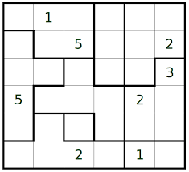
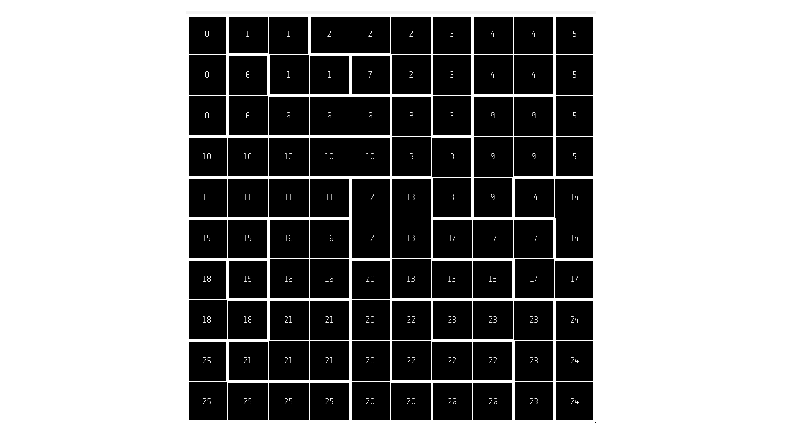
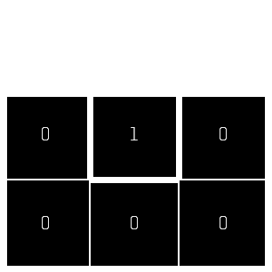
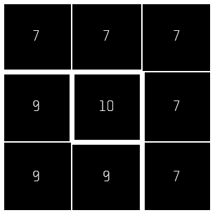

# Tectonic

For a personal passion project I decided to try to automate the process of setting up a Tectonic puzzle myself. I made this project in my own 2D game engine, Amugen, you can find it as the submodule or through here: https://github.com/AdriaanMusschoot/Amugen.

## What is a tectonic, you might wonder?

A Tectonic Puzzle (also known as Suguru) is a logic-based number puzzle where you fill a grid divided into irregularly shaped regions. Each region needs to be filled with the numbers from 1 up to the number of cells in that region, so a 5-cell region will use 1 through 5, for example. The catch is that the same number can’t appear in two cells that touch, even diagonally. Solving it requires a mix of logic, deduction, and pattern recognition, often starting with regions that have only one possible solution and gradually narrowing down options as you move through the grid. Feel free to take a look at this example below!

## Progress

Below you can find some of the issues I have encountered with my first approach. My first approach went something like this, we start in the top left corner. We generate some random directions and look if the cell in that direction is already taken or if there is no cell there, sort of a flood fill.
I hadn't foreseen this but there were some issues that arose.

### Impossible shapes

Some shapes become impossible to fill up with the correct numbers later on. Take this shape for example. Whatever is filled in in the middle square (1),
is impossible to fill in any of the surrounding squares, making the outer shape (0) impossible to fill due to the ruleset of Tectonics.
For a solution and my next approach, ill be trying to layout predetermined shapes instead of this flood fill approach.

### Blocking shapes

Here in a similar fashion to the first one it is also impossible to fill up. If there were a 4 or 5 filled in as part of a bigger shape (10), the shape (9) is not impossible to fill up. However due to the nature of the approach a shape with size one make this impossible to fill up. To solve this I will try to pre-emptively fill in the shape with its digits. I could then unwind the stack and place a different shape and try again.

